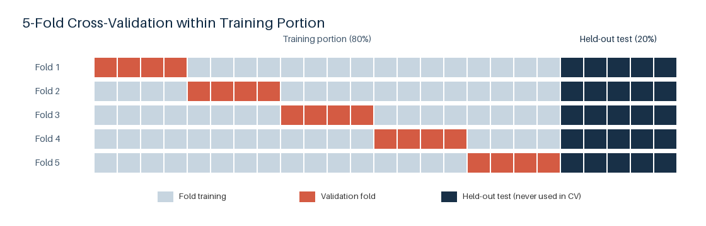

# Data Splits

## 切分方式

1. 使用 `train_test_split` 將完整資料切成 training portion（14,724 筆，80%）與 held-out test（3,681 筆，20%）。
2. 只在 training portion 內使用 `KFold` 建立 5 folds。
3. `random_state=42`、`shuffle=True`；所有實驗共用相同 indices。
4. Held-out test 不參與 EDA、feature decision、preprocessing fitting、model selection 或 tuning。



## 目錄結構

```text
data/splits/
├── train.csv
├── train_indices.csv
├── test.csv
├── test_indices.csv
├── split_diagram.png
└── train_5-fold_cv/
    ├── fold_1/
    │   ├── train.csv
    │   ├── train_indices.csv
    │   ├── validation.csv
    │   └── validation_indices.csv
    ├── fold_2/
    ├── fold_3/
    ├── fold_4/
    └── fold_5/
```

`train.csv`／`test.csv` 是訓練資料和測試資料；`train_indices.csv`／`test_indices.csv` 保存對應的原始 row index。  

`train_5-fold_cv` 底下的每個 `fold_k/` 直接提供該次 CV 使用的 training 與 validation CSV 及 indices。

## 重現

此目錄與示意圖由 `src/split_data.py` 產生：

```bash
FC26_DATA_PATH=data/FC26_20250921.csv python src/split_data.py
```
