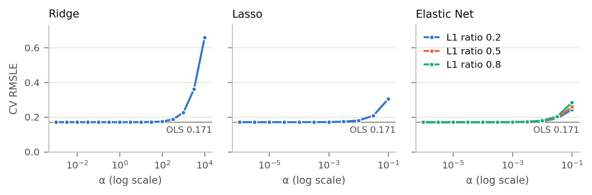
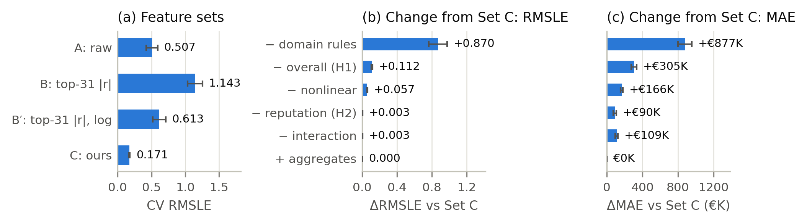

# Experiments_and_Ablation

**模型選擇與消融只使用 training portion 的 5-fold CV；held-out test 在所有設計決定固定後只評估一次。** 本文件整理 part 2（主實驗、超參數、消融實驗）的設定、結果與解讀；decision threshold 的定義、理由與使用方式另見 `doc/Decision_Threshold.md`。報告用表格由 `src/make_report_tables.py` 產生（`results/report/`，含 Markdown 與 LaTeX）；圖由 `src/make_report_figures.py` 產生（PNG 在 `png/`，PDF 在 `results/report/`）。

## Experimental Setup

| Item | Setting |
|---|---|
| Folds | 固定 80/20 split 的 training portion（14,724 筆）做 5-fold `KFold`；所有模型共用相同 folds |
| Target | `log1p(value_eur)`，預測時以 `expm1` 還原；預測值截在 [0, 該 fold training 最高身價] |
| Primary metric | RMSLE（越低越好） |
| Other metrics | RMSLE（只算身價 > 0）、MAE、MedAE（歐元）、R²；報告 5 個 fold 的 mean ± std |
| Final model | Set C（31 個特徵）上的 OLS |
| Leakage control | 特徵建構、補值、標準化與 Set B 的特徵選擇都只在各 fold 的 training subset 上 fit |

### Feature Sets

| Set | Definition |
|---|---|
| A | part 1 前處理後的原始欄位（各 fold 1,170–1,179 欄）。part 1 另外加入的兩個工程欄位 `overall_squared`、`overall_x_reputation` 不是原始欄位，因此排除 |
| B | 在每個 fold 的 training subset 上，依 \|Pearson r(欄位, value_eur)\| 從 Set A 選前 k = 31 欄；k 與 Set C 的特徵數相同，讓兩者的特徵預算一致 |
| B' | 同 B，但改用 log1p(value_eur) 計算相關係數（robustness 檢查） |
| C | 最終模型：由原始欄位建構的 31 個精簡特徵（見下表） |

| Set C group | Features |
|---|---|
| base | `overall`、`potential`、`age`、`height_cm`、`weight_kg`、`weak_foot`、`skill_moves`、`international_reputation`、`league_level`、`contract_years_left`、`club_tenure_years` |
| summary_ratings | `pace`、`shooting`、`passing`、`dribbling`、`defending`、`physic`（門將填 0） |
| position | `is_goalkeeper`、`is_defender`、`is_forward`（參考組為中場） |
| profile | `left_footed`、`real_face`、`unique_body_type`、`in_national_team`、`on_loan` |
| nonlinear | `overall_sq_centered`、`age_sq_centered` |
| interaction | `overall_x_reputation`（中心化後相乘） |
| domain_rules | `is_free_agent`、`age40_outfield`（40 歲以上非門將）、`top5_league` |

`domain_rules` 的前兩個特徵來自資料中的身價為 0 規則：training portion 的 93 位 €0 球員剛好是 74 位自由球員加 19 位 40 歲以上、有球會的非門將，沒有例外；40 歲以上的 13 位門將身價都大於 0。

## Baselines

| Tier | Model | Features | Hyperparameters |
|---|---|---|---|
| Trivial | training-set mean | — | — |
| Simple | OLS（log1p target） | `overall` | — |
| Strong | Random Forest（log1p target，300 trees） | part 1 前處理後全部欄位（1,172–1,181 欄） | `max_features` ∈ {0.1, 0.2, 0.33, 0.5, 1.0} × `min_samples_leaf` ∈ {1, 2, 4}，在身價 > 0 的 5-fold CV 上搜尋；選到 1.0 與 1 |

## Linear Variant Selection

| Variant | Search space | Best setting | CV RMSLE |
|---|---|---|---|
| ols (selected) | — | — | 0.1711 ± 0.0091 |
| ridge | alpha ∈ [0.001, 10000]（15 個值，log grid） | alpha = 0.001 | 0.1711 ± 0.0091 |
| lasso | alpha ∈ [1e-06, 0.1]（11 個值） | alpha = 1e-06 | 0.1711 ± 0.0091 |
| elastic_net | alpha ∈ [1e-06, 0.1]（11 個值）× l1_ratio ∈ {0.2, 0.5, 0.8} | alpha = 1e-06、l1_ratio = 0.8 | 0.1711 ± 0.0091 |



- **Tuning curve 幾乎是平的：** Ridge 在 α ≤ 10 時 RMSLE 都在 0.1711–0.1713，α = 100 開始變差（0.175），α = 10⁴ 升到 0.658；Lasso 在 α = 0.1 時為 0.305。完整曲線在 `results/linear/main/tuning_curves.csv`。
- **三種正則化變體選到的都是 grid 最小的懲罰，也就是退化成 OLS。** n（約 11,800）遠大於 p（31），正則化沒有可以減少的變異。
- **VIF：** 31 個特徵中有 12 個 VIF > 10，最高是 `dribbling` 51.6、`passing` 38.0、`is_goalkeeper` 33.4（門將的摘要能力值填 0，與 `is_goalkeeper` 高度相關）。共線性會放大個別係數的標準誤，但不影響預測；正則化在 CV 上也沒有改善。
- **選模規則：** 除非有正則化的變體比 OLS 好超過一個標準誤（fold std / √5 = 0.0041），否則採用 OLS，因為 OLS 可以直接用 t 檢定報告每個係數的 p 值與信賴區間（§8.1）。

## Main Results (CV)

| Model | RMSLE | RMSLE (value > 0) | Within ±20% (%) | MAE (€K) | MedAE (€K) | R² |
|---|---|---|---|---|---|---|
| Trivial (training mean) | 2.002 ± 0.068 | 1.621 ± 0.024 | 7.4 ± 0.3 | 3,248 ± 63 | 2,169 ± 27 | 0.000 ± 0.000 |
| Simple (OLS on overall) | 1.293 ± 0.129 | 0.596 ± 0.007 | 26.3 ± 0.9 | 1,533 ± 54 | 292 ± 10 | 0.468 ± 0.013 |
| Strong (Random Forest) | 0.269 ± 0.114 | **0.098 ± 0.031 †** | **97.8 ± 0.4** | **174 ± 14** | **17 ± 1** | 0.969 ± 0.012 |
| Ours (OLS, Set C) | **0.171 ± 0.009 †** | 0.156 ± 0.006 † | 86.2 ± 0.4 | 362 ± 17 | 71 ± 2 | **0.976 ± 0.005** |

粗體為每欄最佳的 mean。四種線性變體的 CV 分數完全相同，表中只列最終採用的 OLS。「Within ±20%」是身價 > 0 的球員中，預測誤差在 decision threshold（±20%）以內的比例；† 表示 RMSLE ≤ ln(1.2) = 0.182，也就是典型相對誤差在門檻內（見 `doc/Decision_Threshold.md`）。

### 結論：最終模型輸給 strong baseline（Random Forest）

整體 RMSLE 上 ours 看起來比 RF 好，但這個差距不顯著，而且來自少數特例；對絕大多數球員，RF 的預測都比較準。

| Metric | Ours | RF | Folds where RF is better | Paired t-test p (5 folds) |
|---|---:|---:|---:|---:|
| RMSLE | 0.171 | 0.269 | 1/5 | 0.11 |
| RMSLE (value > 0) | 0.156 | 0.098 | 5/5 | 0.009 |
| Within ±20%（decision threshold） | 86.2% | 97.8% | 5/5 | < 0.001 |
| MAE (€K) | 362 | 174 | 5/5 | < 0.001 |
| MedAE (€K) | 71 | 17 | 5/5 | < 0.001 |
| RMSE (€K) | 1,223 | 1,386 | 1/5 | 0.40 |
| R² | 0.976 | 0.969 | 1/5 | 0.38 |

1. **RF 的整體 RMSLE 被少數 40 歲以上的球員拉高。** 每個 fold 中，RF 最差的 3 筆就佔了該 fold 平方 log 誤差的 58%–91%，而且這 15 筆全部是 40 歲以上的球員。例如：

   | Player | Age | Actual | RF prediction | Ours prediction |
   |---|---:|---:|---:|---:|
   | Cristiano Ronaldo | 40 | €0 | €15,191,572 | €68 |
   | Dante | 41 | €0 | €2,247,467 | €11 |
   | R. Pasveer（GK） | 41 | €625,000 | €798 | €307,718 |

   身價為 0 的 40 歲以上非門將在 training 中只有 19 位，而且同年齡的門將身價大於 0，RF 很難從隨機切分中學到這條規則；ours 直接用 `age40_outfield` 與 `is_free_agent` 表達，CV 中 93 位 €0 球員的預測最高只有 €68。

2. **RMSLE 對 €0 球員極度敏感。** log1p 尺度上，把 €0 預測成 €68 的誤差就有 4.2（相當於把 €1M 預測成 €66M 的 log 誤差），但換成歐元幾乎是 0。因此主表同時報告只算身價 > 0 的 RMSLE 與 MAE。

3. **Held-out test 上 RF 明顯較好（RMSLE 0.078 vs 0.160）。** test 有 16 位 €0 球員：15 位自由球員，以及只有 1 位有球會、40 歲以上的非門將。RF 在 CV 中的主要弱點在 test 上幾乎沒有出現，因此 test 結果與 CV 中「身價 > 0」的比較一致。

4. **為什麼 RF 在一般球員上較準：** 身價與 `overall`、`potential`、`age`、位置之間有高度非線性與交互作用（例如年輕高潛力球員的溢價），樹模型可以分段擬合；線性模型只能用少數平方項與交互項近似。

5. **最終模型的價值：** 在作業限制（最終模型必須是線性迴歸）下，ours 用 31 個可解釋的特徵達到 CV R² 0.976，每個係數都有 β、95% CI、p 值與 VIF；歐元尺度的 RMSE 與 R² 和 RF 沒有顯著差異，在完整 training portion 上訓練約 0.02 秒（RF 約 48 秒）。

### Held-out Test (evaluated once)

| Model | RMSLE | RMSLE (value > 0) | Within ±20% (%) | MAE (€K) | MedAE (€K) | R² |
|---|---|---|---|---|---|---|
| Trivial (training mean) | 1.867 | 1.592 | 8.2 | 3,265 | 2,139 | 0.000 |
| Simple (OLS on overall) | 1.109 | 0.593 | 25.3 | 1,572 | 304 | 0.478 |
| Strong (Random Forest) | **0.078 †** | **0.070 †** | **98.2** | **155** | **16** | **0.979** |
| Ours (OLS, Set C) | 0.160 † | 0.155 † | 85.8 | 365 | 74 | 0.977 |

逐筆預測在 `results/final_test/test_predictions.csv`，每位球員的相對誤差與是否在門檻內在 `results/threshold/test_player_errors.csv`，供 part 3 的顯著性檢定與錯誤案例分析使用。

## Decision Threshold

**門檻（2026-10-09 決定）：身價 > 0 的球員，預測與實際身價的相對誤差在 ±20% 以內，視為不會改變使用者的決策。** 使用情境是球探在轉會前用預測身價判斷報價是否合理；用相對誤差是因為身價從 €0 到 €1.745 億都有，固定金額的門檻對球星太嚴格、對一般球員太寬鬆。對應到 RMSLE 的門檻是 ln(1.2) ≈ 0.182。完整理由、敏感度分析與給 part 3 的使用說明見 `doc/Decision_Threshold.md`。

| Model | CV：在門檻內 | CV RMSLE（典型相對誤差） | Test：在門檻內 | Test RMSLE（典型相對誤差） |
|---|---:|---:|---:|---:|
| Trivial (training mean) | 7.4% | 2.002（640%） | 8.2% | 1.867（547%） |
| Simple (OLS on overall) | 26.3% | 1.293（264%） | 25.3% | 1.109（203%） |
| Strong (Random Forest) | **97.8%** | 0.269（30.8%） | **98.2%** | 0.078 †（8.1%） |
| Ours (OLS, Set C) | 86.2% | 0.171 †（18.7%） | 85.8% | 0.160 †（17.3%） |

- 最終模型對約 86% 身價 > 0 的球員，預測誤差在 ±20% 以內，CV 與 test 一致；RF 約 98%。
- 門檻是在 test 評估之後才決定的。改用 ±10%、±30% 或 ±50% 時，模型排名都是 RF > Ours > Simple > Trivial（`results/report/threshold_sensitivity.tex`），所以這個選擇不影響結論。

## Ablation Study (§7.2)

所有特徵集使用相同的模型（OLS）、相同的 5-fold 與相同的調參流程。Δ 與 paired t-test 都是同一個 fold 上與 Set C 相減；「Within ±20%」與 † 的意義同主表。

| Feature set | #Features | RMSLE | Within ±20% (%) | ΔRMSLE vs C | Folds worse than C | Paired t p | MAE (€K) | R² |
|---|---|---|---|---|---|---|---|---|
| A: processed raw columns | 1,170–1,179 | 0.507 ± 0.083 | 61.6 ± 1.1 | 0.336 ± 0.079 | 5/5 | < 0.001 | 762 ± 63 | 0.763 ± 0.095 |
| B: top-31 by \|Pearson r\| with value | 31 | 1.143 ± 0.111 | 54.3 ± 0.4 | 0.972 ± 0.110 | 5/5 | < 0.001 | 1,404 ± 147 | 0.321 ± 0.181 |
| B': top-31 by \|Pearson r\| with log1p(value) | 31 | 0.613 ± 0.097 | 56.9 ± 0.6 | 0.442 ± 0.092 | 5/5 | < 0.001 | 930 ± 48 | 0.802 ± 0.024 |
| **C: ours (final)** | 31 | 0.171 ± 0.009 † | 86.2 ± 0.4 | — | — | — | 362 ± 17 | 0.976 ± 0.005 |
| C − nonlinear (overall², age²) | 29 | 0.228 ± 0.007 | 72.2 ± 1.2 | 0.057 ± 0.003 | 5/5 | < 0.001 | 528 ± 13 | 0.946 ± 0.006 |
| C − interaction (overall × reputation) | 30 | 0.174 ± 0.009 † | 85.5 ± 0.4 | 0.003 ± 0.001 | 5/5 | 0.004 | 471 ± 24 | 0.906 ± 0.033 |
| C − domain rules (free agent, age ≥ 40, top-5) | 28 | 1.041 ± 0.105 | 60.7 ± 2.6 | 0.870 ± 0.105 | 5/5 | < 0.001 | 1,239 ± 87 | 0.373 ± 0.103 |
| C − overall and derived (H1) | 28 | 0.283 ± 0.005 | 62.2 ± 1.0 | 0.112 ± 0.006 | 5/5 | < 0.001 | 667 ± 33 | 0.902 ± 0.008 |
| C − reputation and derived (H2) | 29 | 0.175 ± 0.009 † | 85.2 ± 0.4 | 0.003 ± 0.001 | 5/5 | 0.002 | 452 ± 25 | 0.922 ± 0.029 |
| C + club/league mean overall | 33 | 0.171 ± 0.009 † | 86.2 ± 0.4 | 0.000 ± 0.000 | 2/5 | 0.658 | 362 ± 17 | 0.976 ± 0.005 |



除了 aggregates 之外，每個差距都在 5 個 fold 一致出現，且大於 fold 之間的變異。誤差線為 fold 之間的 ±1 std；(b)(c) 是同一個 fold 上與 Set C 相減後的差異。

### Set A、B、C

- **Set C 比 Set A 好 0.336。** Set A 雖然有自由球員（club 缺值）指標，但沒有 40 歲規則與 `age` 的平方項；一千多個欄位也讓結果在 fold 之間不穩定（R² 的 std 0.095）。
- **Set B 比 Set A 還差，原因有三：**
  1. **選到大量完全重複的欄位。** 每個 fold 的 31 欄中有 7–9 欄與排名更前面的欄位完全共線，例如 `cm_base`／`lcm_base`／`rcm_base` 三欄相同、`lb_modifier`／`rb_modifier` 相同、三個 `nation_*___NOT_SELECTED__` 相同、`real_face_Yes`／`real_face_No` 互補。實際上只有 22–24 個不同的訊號。
  2. **raw 身價高度偏態（skewness 8.6）**，Pearson r 被少數球星主導，選到 `international_reputation`、`player_traits____RARE__` 等「球星指標」，而不是能解釋一般球員身價的欄位。
  3. **選不到 `age` 與 €0 指標。** `age` 與身價的關係是先升後降，Pearson r 接近 0；自由球員（club 缺值）指標在 5 個 fold 都沒有被選進來，40 歲規則則本來就不在 Set A 中。
- **B' 只部分改善。** 改用 log1p(value) 排序後會選到自由球員指標，RMSLE 降到 0.613，但 31 欄中有 15 欄是重複的位置評分與缺值指標，仍遠差於 Set C。
- 每個 fold 選到的欄位與共線標記存在 `results/linear/ablation/set_b_selected_features.csv`。

### 工程特徵群組

- **domain_rules 最重要（+0.870）：** 移除後 €0 球員無法預測為 0。
- **nonlinear（+0.057）：** `overall` 的凸性與 `age` 的倒 U 形都需要平方項。
- **interaction（+0.003，但 R² 0.976 → 0.906、MAE €362K → €471K）：** 對 RMSLE 影響小，但對高身價球員的歐元誤差影響很大。
- **aggregates（球會／聯賽平均 overall）沒有幫助**（2/5 folds，p = 0.66），因此最終模型不使用。

### Part 1 假設的驗證（H1、H2）

`doc/Exploratory_Feature_Analysis_and_Feature_Engineering.md` 的 H1、H2 寫成「有該特徵的模型應優於移除它的相同模型」，因此在 Set C 上移除該欄位以及所有由它衍生的特徵：

- **H1（`overall`）成立：** 移除 `overall`、`overall_sq_centered`、`overall_x_reputation` 後 RMSLE 0.171 → 0.283，5 個 fold 都變差（p < 0.001），R² 0.976 → 0.902。其他能力值（`potential`、六項摘要能力）無法取代 `overall`。
- **H2（`international_reputation`）成立，但效果集中在高身價球員：** 移除 `international_reputation` 與 `overall_x_reputation` 後 RMSLE 只多 0.003，但 5 個 fold 都變差（p = 0.002），R² 0.976 → 0.922，MAE €362K → €452K。

## Slice Analysis

CV out-of-fold 預測依身價、聯賽等級、位置與年齡分群（「Within ±20%」只算身價 > 0 的球員，€0 球員沒有定義；粗體為較佳者）：

| Dimension | Slice | n | RMSLE RF | RMSLE Ours | Within ±20% (%) RF | Within ±20% (%) Ours |
|---|---|---|---|---|---|---|
| value band | €0 | 93 | 3.382 | **0.898** | — | — |
| value band | <€1M | 7,201 | **0.129** | 0.167 | **97.0** | 87.9 |
| value band | €1M–10M | 6,543 | **0.058** | 0.136 | **99.0** | 86.0 |
| value band | ≥€10M | 887 | **0.100** | 0.199 | **95.4** | 74.2 |
| league level | level 1 | 10,799 | 0.334 | **0.170** | **97.4** | 85.0 |
| league level | level 2 | 2,317 | **0.048** | 0.144 | **99.1** | 88.6 |
| league level | level 3–4 | 1,534 | **0.071** | 0.136 | **98.8** | 91.1 |
| league level | no club | 74 | **0.006** | 0.769 | — | — |
| position | GK | 1,672 | **0.241** | 0.275 | **94.0** | 74.1 |
| position | DEF | 4,864 | 0.268 | **0.139** | **98.1** | 88.8 |
| position | MID | 5,514 | 0.208 | **0.151** | **98.3** | 86.9 |
| position | FWD | 2,674 | 0.445 | **0.180** | **98.6** | 87.7 |
| age band | ≤21 | 3,749 | **0.037** | 0.117 | **99.8** | 92.1 |
| age band | 22–29 | 8,057 | **0.048** | 0.140 | **99.5** | 87.9 |
| age band | ≥30 | 2,918 | 0.639 | **0.276** | **90.5** | 73.7 |

- **身價 > 0 的球員，RF 在每一個分群都比較準**：RF 在門檻內的比例為 90.5%–99.8%，ours 為 73.7%–92.1%。
- Ours 只在含有 40 歲以上 €0 球員的分群（€0、level 1、DEF／MID／FWD、≥30 歲）RMSLE 較低，原因與主表相同。
- 自由球員（no club）RF 預測剛好為 0；ours 的預測在 €0–€8 之間（平均不到 €1），log 誤差因此偏大，但歐元誤差可以忽略。
- Ours 最弱的分群是 ≥30 歲（73.7%）、門將（74.1%）與 ≥€10M（74.2%）的球員，最好的是 ≤21 歲（92.1%）。
- 各特徵集的分群指標在 `results/linear/ablation/slice_metrics.csv`，baseline 與最終模型在 `slice_metrics_main_models.csv`。

## Final Model Coefficients (§8.1)

`results/final_test/coefficients.csv` 列出最終 OLS 在完整 training portion 上的係數：標準化係數 β、classical OLS 標準誤、t 檢定 p 值、95% CI、VIF，以及換回原始單位的近似百分比影響 `pct_change_per_unit = exp(β / SD) − 1`（target 為 log1p 身價）。31 個特徵中有 12 個不顯著（p > 0.05）：`height_cm`、`weight_kg`、`league_level`、`club_tenure_years`、`pace`、`dribbling`、`defending`、`is_goalkeeper`、`left_footed`、`real_face`、`in_national_team`、`on_loan`。

**解讀 `overall` 與 `international_reputation` 時要注意：** 模型含 `overall` 的平方項與 `overall × international_reputation` 交互項，因此表中 `overall` 的「每 +1 分，身價 +14.4%」與 `international_reputation` 的「每 +1 級，身價 +52.7%」，都只是在 `overall` 與 `international_reputation` 都等於 training 平均（65.7 分、1.08 級）時的邊際效果。其他位置的邊際效果：

| `overall` | IR = 1 | IR = 2 | IR = 3 | IR = 5 |
|---:|---:|---:|---:|---:|
| 60 | +12.3% | +9.6% | +7.0% | +2.0% |
| 65.7（平均） | +14.6% | +11.9% | +9.2% | +4.1% |
| 70 | +16.4% | +13.6% | +10.9% | +5.7% |
| 80 | +20.6% | +17.7% | +14.9% | +9.5% |
| 90 | +24.9% | +22.0% | +19.1% | +13.5% |

表中為 `overall` 每 +1 分的身價變化。`overall` 越高，每多 1 分的溢價越大（凸性）；交互項為負，表示 reputation 越高，`overall` 的邊際效果越小。同理，`international_reputation` 每 +1 級的效果在 `overall` = 70 時約 +37.9%，在 `overall` = 80 時降到約 +8.5%。

## Reproduction

需設定資料目錄；`FC26_N_JOBS` 為 CPU 執行緒上限（預設 16）。依序執行：

```bash
export FC26_SPLIT_DIR=data/splits FC26_PROCESSED_DIR=data/processed_splits
python src/run_tuning.py            # Random Forest 超參數搜尋 → results/tuning/
python src/run_linear_models.py     # 線性變體選擇、VIF、主實驗表 → results/linear/main/
python src/run_linear_ablation.py   # 消融實驗與分群指標 → results/linear/ablation/
python src/run_final_test.py        # held-out test 唯一一次評估 → results/final_test/
python src/threshold_metrics.py     # decision threshold（±20%）的 CV 與 test 指標 → results/threshold/
python src/make_report_tables.py    # 報告用表格 → results/report/
python src/make_report_figures.py   # 報告用圖 → png/、results/report/
```

`run_final_test.py` 在 `results/final_test/test_scores.csv` 已存在時會拒絕執行，確保 test 只使用一次。
