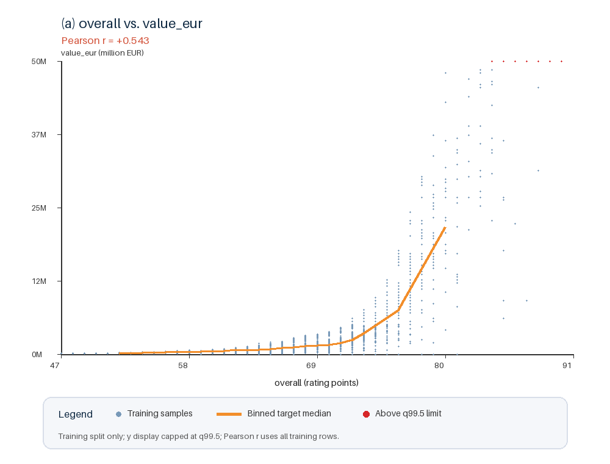
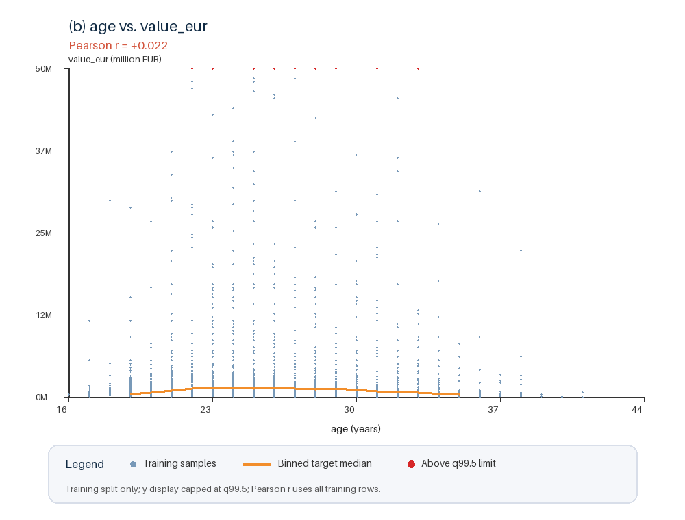
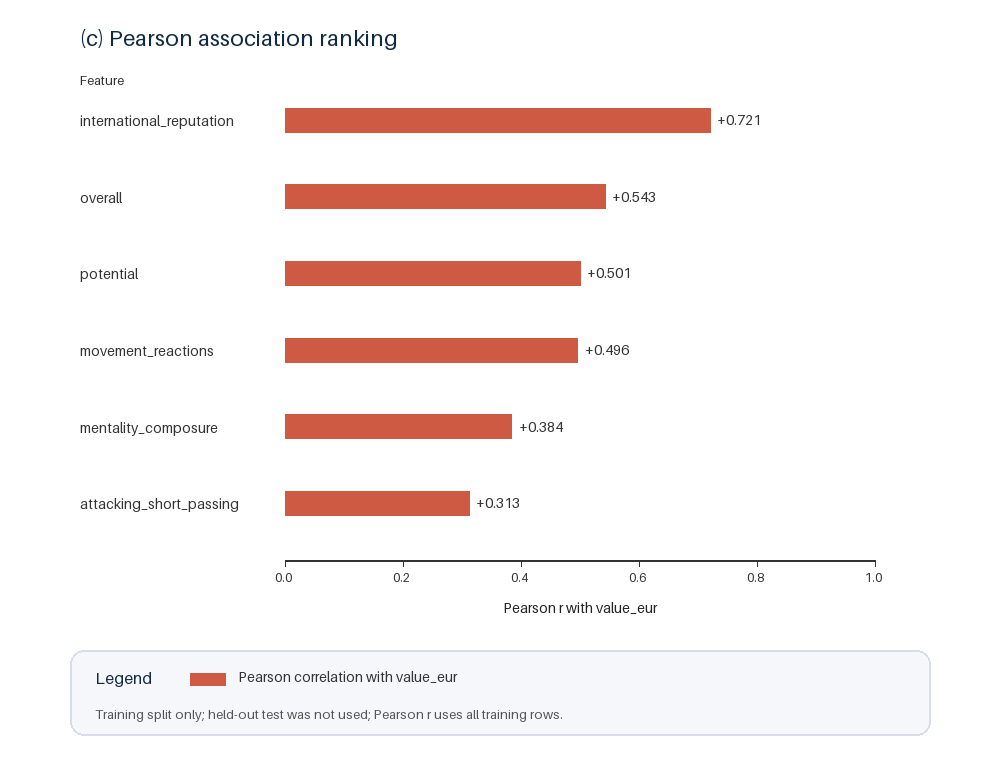

# Exploratory_Feature_Analysis_and_Feature_Engineering

**Training split only; held-out test set was not used.** 以下統計與圖表只使用固定 training set（14,724 筆）。

## Feature–Target Figure

### (a) Overall vs. Player Value



### (b) Age vs. Player Value



### (c) Pearson Association Ranking



`overall` 越高，`value_eur` 整體越高，但高評分區的增幅更快，因此不完全是線性關係。`age` 的 Pearson correlation 接近 0，但圖中的橘色中位數線呈現先升後降，表示年齡可能是非線性關係。

## Pearson Correlation

| Feature | Pearson r with `value_eur` |
|---|---:|
| `international_reputation` | 0.721 |
| `overall` | 0.543 |
| `potential` | 0.501 |
| `movement_reactions` | 0.496 |
| `mentality_composure` | 0.384 |
| `attacking_short_passing` | 0.313 |

## Feature Redundancy Analysis

| Feature pair | Pearson r | Interpretation |
|---|---:|---|
| `pace` vs. `movement_sprint_speed` | 0.967 | 幾乎提供相同的速度資訊，`pace` 很大程度由這種速度細項反映 |
| `pace` vs. `movement_acceleration` | 0.952 | `pace` 很大程度由這種速度細項反映 |
| `overall` vs. `movement_reactions` | 0.886 | `movement_reactions` 與整體能力資訊高度相關 |
| `overall` vs. `potential` | 0.663 | 兩者有相關，但 `potential` 仍代表未來成長空間 |

這裡只有先分析可能 redundancy 的欄位，但這些欄位目前沒有因為可能 redundancy 就直接刪除。

## Possible Feature Actions

| Action | Feature(s) | Evidence and direction |
|---|---|---|
| Keep | `overall`, `potential`, `international_reputation`, `movement_reactions` | 與 target 有較高的 Pearson correlation，可以視為主要候選特徵，優先保留 |
| Keep | `age` | Pearson r 僅 0.022，但圖形呈現先升後降，仍可能包含非線性資訊，因此保留原始欄位 |
| Transform | `club_joined_date` | 原始日期可以轉換為 `club_tenure_years`(截至資料快照日，球員已在目前球會待了幾年)，轉換原因是模型不能直接理解日期字串 2020-07-01，但可以使用「已效力約 5.22 年」這種數值 |
| Drop | `dob` | 與 `age` 表達相同的年齡資訊，保留 `age` 即可 |

## Hypotheses

- **H1:** `overall` (整體能力) 越高，球員身價越高；加入 `overall` 或相關衍生特徵的模型應優於移除 `overall` 的相同模型。
- **H2:** `international_reputation` 越高，球員身價越高；加入 `international_reputation` 或相關衍生特徵的模型應優於移除 `international_reputation` 的相同模型。

## Engineered Feature Groups

| Feature group | New feature(s) | Motivation |
|---|---|---|
| Overall nonlinearity | `overall_squared = overall²` | Feature–target 圖顯示，球員身價在高 `overall` 區間上升得更快。加入平方項可讓線性模型表達這種曲線關係，並對應 H1。 |
| Reputation interaction | `overall_x_reputation = overall × international_reputation` | 相同 `overall` 的球員可能因國際知名度不同而有不同身價。加入交互作用可讓 reputation 改變 overall 對身價的影響，並對應 H2。 |

## Reproduction

圖表與全部 Pearson correlation 可由 `src/eda_feature_report.py` 重現；Pearson 數值會直接顯示在終端：

```bash
FC26_TRAIN_PATH=data/splits/train.csv python src/eda_feature_report.py
```
